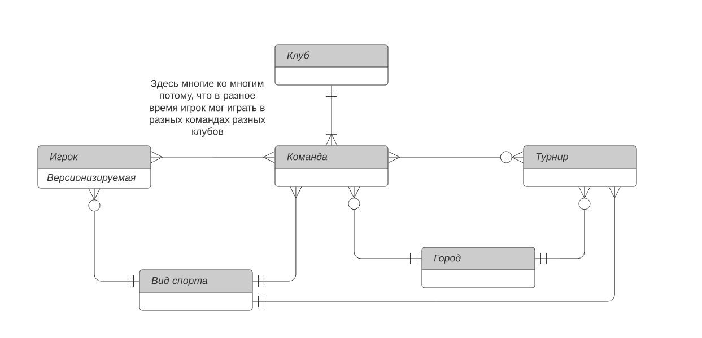
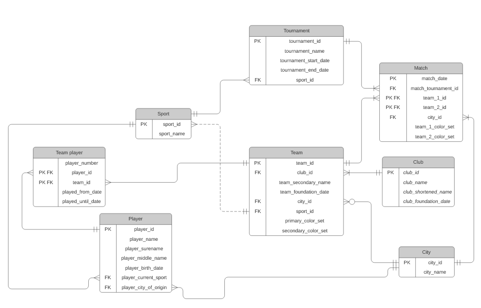

# db-course-project
## Github репозитория для проектной работы по курсу "Базы Данных"

### Задание 1
Предметная область -- спортивные клубы, команды, их игроки и турниры, в которых команды участвуют.

### Задание 2
a) 

b) 

c) 
